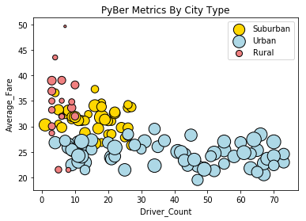
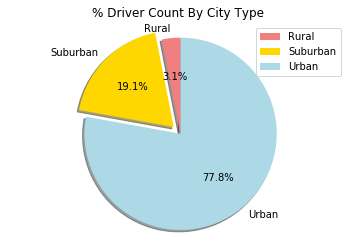
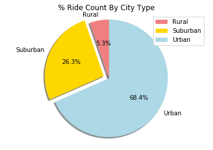
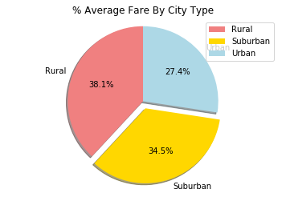

```python
#import dependencies
import pandas as pd
import numpy as np
import matplotlib.pyplot as plt
import random


```


```python
#read csv's
city_data = 'raw_data/city_data.csv'
ride_data = 'raw_data/ride_data.csv'
read1 = pd.read_csv(city_data)
read2 = pd.read_csv(ride_data)
read1
```


<div>
<style>
    .dataframe thead tr:only-child th {
        text-align: right;
    }

    .dataframe thead th {
        text-align: left;
    }

    .dataframe tbody tr th {
        vertical-align: top;
    }
</style>
<table border="1" class="dataframe">
  <thead>
    <tr style="text-align: right;">
      <th></th>
      <th>city</th>
      <th>driver_count</th>
      <th>type</th>
    </tr>
  </thead>
  <tbody>
    <tr>
      <th>0</th>
      <td>Kelseyland</td>
      <td>63</td>
      <td>Urban</td>
    </tr>
    <tr>
      <th>1</th>
      <td>Nguyenbury</td>
      <td>8</td>
      <td>Urban</td>
    </tr>
    <tr>
      <th>2</th>
      <td>East Douglas</td>
      <td>12</td>
      <td>Urban</td>
    </tr>
    <tr>
      <th>3</th>
      <td>West Dawnfurt</td>
      <td>34</td>
      <td>Urban</td>
    </tr>
    <tr>
      <th>4</th>
      <td>Rodriguezburgh</td>
      <td>52</td>
      <td>Urban</td>
    </tr>
    <tr>
      <th>5</th>
      <td>South Josephville</td>
      <td>4</td>
      <td>Urban</td>
    </tr>
    <tr>
      <th>6</th>
      <td>West Sydneyhaven</td>
      <td>70</td>
      <td>Urban</td>
    </tr>
    <tr>
      <th>7</th>
      <td>Travisville</td>
      <td>37</td>
      <td>Urban</td>
    </tr>
    <tr>
      <th>8</th>
      <td>Torresshire</td>
      <td>70</td>
      <td>Urban</td>
    </tr>
    <tr>
      <th>9</th>
      <td>Lisaville</td>
      <td>66</td>
      <td>Urban</td>
    </tr>
    <tr>
      <th>10</th>
      <td>Mooreview</td>
      <td>34</td>
      <td>Urban</td>
    </tr>
    <tr>
      <th>11</th>
      <td>Smithhaven</td>
      <td>67</td>
      <td>Urban</td>
    </tr>
    <tr>
      <th>12</th>
      <td>Carrollfort</td>
      <td>55</td>
      <td>Urban</td>
    </tr>
    <tr>
      <th>13</th>
      <td>Port Josephfurt</td>
      <td>28</td>
      <td>Urban</td>
    </tr>
    <tr>
      <th>14</th>
      <td>Lake Jeffreyland</td>
      <td>15</td>
      <td>Urban</td>
    </tr>
    <tr>
      <th>15</th>
      <td>South Louis</td>
      <td>12</td>
      <td>Urban</td>
    </tr>
    <tr>
      <th>16</th>
      <td>West Peter</td>
      <td>61</td>
      <td>Urban</td>
    </tr>
    <tr>
      <th>17</th>
      <td>Kimberlychester</td>
      <td>13</td>
      <td>Urban</td>
    </tr>
    <tr>
      <th>18</th>
      <td>Alyssaberg</td>
      <td>67</td>
      <td>Urban</td>
    </tr>
    <tr>
      <th>19</th>
      <td>Sarabury</td>
      <td>46</td>
      <td>Urban</td>
    </tr>
    <tr>
      <th>20</th>
      <td>Yolandafurt</td>
      <td>7</td>
      <td>Urban</td>
    </tr>
    <tr>
      <th>21</th>
      <td>Edwardsbury</td>
      <td>11</td>
      <td>Urban</td>
    </tr>
    <tr>
      <th>22</th>
      <td>New Andreamouth</td>
      <td>42</td>
      <td>Urban</td>
    </tr>
    <tr>
      <th>23</th>
      <td>New David</td>
      <td>31</td>
      <td>Urban</td>
    </tr>
    <tr>
      <th>24</th>
      <td>Arnoldview</td>
      <td>41</td>
      <td>Urban</td>
    </tr>
    <tr>
      <th>25</th>
      <td>Williamshire</td>
      <td>70</td>
      <td>Urban</td>
    </tr>
    <tr>
      <th>26</th>
      <td>Lisatown</td>
      <td>47</td>
      <td>Urban</td>
    </tr>
    <tr>
      <th>27</th>
      <td>New Aaron</td>
      <td>60</td>
      <td>Urban</td>
    </tr>
    <tr>
      <th>28</th>
      <td>Swansonbury</td>
      <td>64</td>
      <td>Urban</td>
    </tr>
    <tr>
      <th>29</th>
      <td>Fosterside</td>
      <td>69</td>
      <td>Urban</td>
    </tr>
    <tr>
      <th>...</th>
      <td>...</td>
      <td>...</td>
      <td>...</td>
    </tr>
    <tr>
      <th>96</th>
      <td>New Lynn</td>
      <td>20</td>
      <td>Suburban</td>
    </tr>
    <tr>
      <th>97</th>
      <td>Port Jose</td>
      <td>11</td>
      <td>Suburban</td>
    </tr>
    <tr>
      <th>98</th>
      <td>Johnland</td>
      <td>13</td>
      <td>Suburban</td>
    </tr>
    <tr>
      <th>99</th>
      <td>West Tony</td>
      <td>17</td>
      <td>Suburban</td>
    </tr>
    <tr>
      <th>100</th>
      <td>Port James</td>
      <td>3</td>
      <td>Suburban</td>
    </tr>
    <tr>
      <th>101</th>
      <td>Campbellport</td>
      <td>26</td>
      <td>Suburban</td>
    </tr>
    <tr>
      <th>102</th>
      <td>Port Guytown</td>
      <td>26</td>
      <td>Suburban</td>
    </tr>
    <tr>
      <th>103</th>
      <td>Webstertown</td>
      <td>26</td>
      <td>Suburban</td>
    </tr>
    <tr>
      <th>104</th>
      <td>Clarkstad</td>
      <td>21</td>
      <td>Suburban</td>
    </tr>
    <tr>
      <th>105</th>
      <td>North Tracyfort</td>
      <td>18</td>
      <td>Suburban</td>
    </tr>
    <tr>
      <th>106</th>
      <td>Martinmouth</td>
      <td>5</td>
      <td>Suburban</td>
    </tr>
    <tr>
      <th>107</th>
      <td>New Jessicamouth</td>
      <td>22</td>
      <td>Suburban</td>
    </tr>
    <tr>
      <th>108</th>
      <td>South Elizabethmouth</td>
      <td>3</td>
      <td>Rural</td>
    </tr>
    <tr>
      <th>109</th>
      <td>East Troybury</td>
      <td>3</td>
      <td>Rural</td>
    </tr>
    <tr>
      <th>110</th>
      <td>Kinghaven</td>
      <td>3</td>
      <td>Rural</td>
    </tr>
    <tr>
      <th>111</th>
      <td>New Johnbury</td>
      <td>6</td>
      <td>Rural</td>
    </tr>
    <tr>
      <th>112</th>
      <td>Erikport</td>
      <td>3</td>
      <td>Rural</td>
    </tr>
    <tr>
      <th>113</th>
      <td>Jacksonfort</td>
      <td>6</td>
      <td>Rural</td>
    </tr>
    <tr>
      <th>114</th>
      <td>Shelbyhaven</td>
      <td>9</td>
      <td>Rural</td>
    </tr>
    <tr>
      <th>115</th>
      <td>Matthewside</td>
      <td>4</td>
      <td>Rural</td>
    </tr>
    <tr>
      <th>116</th>
      <td>Kennethburgh</td>
      <td>3</td>
      <td>Rural</td>
    </tr>
    <tr>
      <th>117</th>
      <td>South Joseph</td>
      <td>3</td>
      <td>Rural</td>
    </tr>
    <tr>
      <th>118</th>
      <td>Manuelchester</td>
      <td>7</td>
      <td>Rural</td>
    </tr>
    <tr>
      <th>119</th>
      <td>Stevensport</td>
      <td>6</td>
      <td>Rural</td>
    </tr>
    <tr>
      <th>120</th>
      <td>North Whitney</td>
      <td>10</td>
      <td>Rural</td>
    </tr>
    <tr>
      <th>121</th>
      <td>East Stephen</td>
      <td>6</td>
      <td>Rural</td>
    </tr>
    <tr>
      <th>122</th>
      <td>East Leslie</td>
      <td>9</td>
      <td>Rural</td>
    </tr>
    <tr>
      <th>123</th>
      <td>Hernandezshire</td>
      <td>10</td>
      <td>Rural</td>
    </tr>
    <tr>
      <th>124</th>
      <td>Horneland</td>
      <td>8</td>
      <td>Rural</td>
    </tr>
    <tr>
      <th>125</th>
      <td>West Kevintown</td>
      <td>5</td>
      <td>Rural</td>
    </tr>
  </tbody>
</table>
<p>126 rows × 3 columns</p>
</div>


```python
read2.head()
```


<div>
<style>
    .dataframe thead tr:only-child th {
        text-align: right;
    }

    .dataframe thead th {
        text-align: left;
    }

    .dataframe tbody tr th {
        vertical-align: top;
    }
</style>
<table border="1" class="dataframe">
  <thead>
    <tr style="text-align: right;">
      <th></th>
      <th>city</th>
      <th>date</th>
      <th>fare</th>
      <th>ride_id</th>
    </tr>
  </thead>
  <tbody>
    <tr>
      <th>0</th>
      <td>Sarabury</td>
      <td>2016-01-16 13:49:27</td>
      <td>38.35</td>
      <td>5403689035038</td>
    </tr>
    <tr>
      <th>1</th>
      <td>South Roy</td>
      <td>2016-01-02 18:42:34</td>
      <td>17.49</td>
      <td>4036272335942</td>
    </tr>
    <tr>
      <th>2</th>
      <td>Wiseborough</td>
      <td>2016-01-21 17:35:29</td>
      <td>44.18</td>
      <td>3645042422587</td>
    </tr>
    <tr>
      <th>3</th>
      <td>Spencertown</td>
      <td>2016-07-31 14:53:22</td>
      <td>6.87</td>
      <td>2242596575892</td>
    </tr>
    <tr>
      <th>4</th>
      <td>Nguyenbury</td>
      <td>2016-07-09 04:42:44</td>
      <td>6.28</td>
      <td>1543057793673</td>
    </tr>
  </tbody>
</table>
</div>


```python
avg_fare = read2.groupby("city",as_index=False)["fare"].mean()
ride_count = read2.groupby("city",as_index=False)["ride_id"].count()
ride_count.head()

```


<div>
<style>
    .dataframe thead tr:only-child th {
        text-align: right;
    }

    .dataframe thead th {
        text-align: left;
    }

    .dataframe tbody tr th {
        vertical-align: top;
    }
</style>
<table border="1" class="dataframe">
  <thead>
    <tr style="text-align: right;">
      <th></th>
      <th>city</th>
      <th>ride_id</th>
    </tr>
  </thead>
  <tbody>
    <tr>
      <th>0</th>
      <td>Alvarezhaven</td>
      <td>31</td>
    </tr>
    <tr>
      <th>1</th>
      <td>Alyssaberg</td>
      <td>26</td>
    </tr>
    <tr>
      <th>2</th>
      <td>Anitamouth</td>
      <td>9</td>
    </tr>
    <tr>
      <th>3</th>
      <td>Antoniomouth</td>
      <td>22</td>
    </tr>
    <tr>
      <th>4</th>
      <td>Aprilchester</td>
      <td>19</td>
    </tr>
  </tbody>
</table>
</div>


```python
count = read1['city'].value_counts()
count
```


    Port James              2
    East Douglas            1
    Manuelchester           1
    North Whitney           1
    East Erin               1
    Conwaymouth             1
    Lisaville               1
    Port Martinberg         1
    Prattfurt               1
    South Roy               1
    West Alexis             1
    Port Alexandria         1
    Arnoldview              1
    Maryside                1
    Alyssaberg              1
    New Cindyborough        1
    West Sydneyhaven        1
    Sarahview               1
    Port Guytown            1
    East Leslie             1
    Port Josephfurt         1
    East Stephen            1
    South Josephville       1
    Thomastown              1
    West Evan               1
    Fosterside              1
    Spencertown             1
    Lake Brenda             1
    Mooreview               1
    South Joseph            1
                           ..
    Travisville             1
    Jacksonfort             1
    Floresberg              1
    Clarkstad               1
    New Michelleberg        1
    West Tony               1
    Davistown               1
    Russellport             1
    Alvarezhaven            1
    South Louis             1
    Carrollfort             1
    New Christine           1
    Pamelahaven             1
    South Bryanstad         1
    Kinghaven               1
    New David               1
    Horneland               1
    Rodriguezburgh          1
    Kellershire             1
    West Peter              1
    Nguyenbury              1
    Lisatown                1
    Lake Stevenbury         1
    South Elizabethmouth    1
    East Troybury           1
    West Oscar              1
    Stevensport             1
    Kelseyland              1
    Lake Jennaton           1
    Kyleton                 1
    Name: city, Length: 125, dtype: int64


```python

filter_1 = read1.loc[read1['city'] == 'Port James']
filter_1

```


<div>
<style>
    .dataframe thead tr:only-child th {
        text-align: right;
    }

    .dataframe thead th {
        text-align: left;
    }

    .dataframe tbody tr th {
        vertical-align: top;
    }
</style>
<table border="1" class="dataframe">
  <thead>
    <tr style="text-align: right;">
      <th></th>
      <th>city</th>
      <th>driver_count</th>
      <th>type</th>
    </tr>
  </thead>
  <tbody>
    <tr>
      <th>84</th>
      <td>Port James</td>
      <td>15</td>
      <td>Suburban</td>
    </tr>
    <tr>
      <th>100</th>
      <td>Port James</td>
      <td>3</td>
      <td>Suburban</td>
    </tr>
  </tbody>
</table>
</div>


```python
# To clean the above data, I will sum use groupby sum
city_driver_count = read1.groupby(["city","type"],as_index=False)["driver_count"].sum()
city_driver_count
```


<div>
<style>
    .dataframe thead tr:only-child th {
        text-align: right;
    }

    .dataframe thead th {
        text-align: left;
    }

    .dataframe tbody tr th {
        vertical-align: top;
    }
</style>
<table border="1" class="dataframe">
  <thead>
    <tr style="text-align: right;">
      <th></th>
      <th>city</th>
      <th>type</th>
      <th>driver_count</th>
    </tr>
  </thead>
  <tbody>
    <tr>
      <th>0</th>
      <td>Alvarezhaven</td>
      <td>Urban</td>
      <td>21</td>
    </tr>
    <tr>
      <th>1</th>
      <td>Alyssaberg</td>
      <td>Urban</td>
      <td>67</td>
    </tr>
    <tr>
      <th>2</th>
      <td>Anitamouth</td>
      <td>Suburban</td>
      <td>16</td>
    </tr>
    <tr>
      <th>3</th>
      <td>Antoniomouth</td>
      <td>Urban</td>
      <td>21</td>
    </tr>
    <tr>
      <th>4</th>
      <td>Aprilchester</td>
      <td>Urban</td>
      <td>49</td>
    </tr>
    <tr>
      <th>5</th>
      <td>Arnoldview</td>
      <td>Urban</td>
      <td>41</td>
    </tr>
    <tr>
      <th>6</th>
      <td>Campbellport</td>
      <td>Suburban</td>
      <td>26</td>
    </tr>
    <tr>
      <th>7</th>
      <td>Carrollbury</td>
      <td>Suburban</td>
      <td>4</td>
    </tr>
    <tr>
      <th>8</th>
      <td>Carrollfort</td>
      <td>Urban</td>
      <td>55</td>
    </tr>
    <tr>
      <th>9</th>
      <td>Clarkstad</td>
      <td>Suburban</td>
      <td>21</td>
    </tr>
    <tr>
      <th>10</th>
      <td>Conwaymouth</td>
      <td>Suburban</td>
      <td>18</td>
    </tr>
    <tr>
      <th>11</th>
      <td>Davidtown</td>
      <td>Urban</td>
      <td>73</td>
    </tr>
    <tr>
      <th>12</th>
      <td>Davistown</td>
      <td>Urban</td>
      <td>25</td>
    </tr>
    <tr>
      <th>13</th>
      <td>East Cherylfurt</td>
      <td>Suburban</td>
      <td>9</td>
    </tr>
    <tr>
      <th>14</th>
      <td>East Douglas</td>
      <td>Urban</td>
      <td>12</td>
    </tr>
    <tr>
      <th>15</th>
      <td>East Erin</td>
      <td>Urban</td>
      <td>43</td>
    </tr>
    <tr>
      <th>16</th>
      <td>East Jenniferchester</td>
      <td>Suburban</td>
      <td>22</td>
    </tr>
    <tr>
      <th>17</th>
      <td>East Leslie</td>
      <td>Rural</td>
      <td>9</td>
    </tr>
    <tr>
      <th>18</th>
      <td>East Stephen</td>
      <td>Rural</td>
      <td>6</td>
    </tr>
    <tr>
      <th>19</th>
      <td>East Troybury</td>
      <td>Rural</td>
      <td>3</td>
    </tr>
    <tr>
      <th>20</th>
      <td>Edwardsbury</td>
      <td>Urban</td>
      <td>11</td>
    </tr>
    <tr>
      <th>21</th>
      <td>Erikport</td>
      <td>Rural</td>
      <td>3</td>
    </tr>
    <tr>
      <th>22</th>
      <td>Eriktown</td>
      <td>Urban</td>
      <td>15</td>
    </tr>
    <tr>
      <th>23</th>
      <td>Floresberg</td>
      <td>Suburban</td>
      <td>7</td>
    </tr>
    <tr>
      <th>24</th>
      <td>Fosterside</td>
      <td>Urban</td>
      <td>69</td>
    </tr>
    <tr>
      <th>25</th>
      <td>Hernandezshire</td>
      <td>Rural</td>
      <td>10</td>
    </tr>
    <tr>
      <th>26</th>
      <td>Horneland</td>
      <td>Rural</td>
      <td>8</td>
    </tr>
    <tr>
      <th>27</th>
      <td>Jacksonfort</td>
      <td>Rural</td>
      <td>6</td>
    </tr>
    <tr>
      <th>28</th>
      <td>Jacobfort</td>
      <td>Urban</td>
      <td>52</td>
    </tr>
    <tr>
      <th>29</th>
      <td>Jasonfort</td>
      <td>Suburban</td>
      <td>25</td>
    </tr>
    <tr>
      <th>...</th>
      <td>...</td>
      <td>...</td>
      <td>...</td>
    </tr>
    <tr>
      <th>95</th>
      <td>South Roy</td>
      <td>Urban</td>
      <td>35</td>
    </tr>
    <tr>
      <th>96</th>
      <td>South Shannonborough</td>
      <td>Suburban</td>
      <td>9</td>
    </tr>
    <tr>
      <th>97</th>
      <td>Spencertown</td>
      <td>Urban</td>
      <td>68</td>
    </tr>
    <tr>
      <th>98</th>
      <td>Stevensport</td>
      <td>Rural</td>
      <td>6</td>
    </tr>
    <tr>
      <th>99</th>
      <td>Stewartview</td>
      <td>Urban</td>
      <td>49</td>
    </tr>
    <tr>
      <th>100</th>
      <td>Swansonbury</td>
      <td>Urban</td>
      <td>64</td>
    </tr>
    <tr>
      <th>101</th>
      <td>Thomastown</td>
      <td>Suburban</td>
      <td>1</td>
    </tr>
    <tr>
      <th>102</th>
      <td>Tiffanyton</td>
      <td>Suburban</td>
      <td>21</td>
    </tr>
    <tr>
      <th>103</th>
      <td>Torresshire</td>
      <td>Urban</td>
      <td>70</td>
    </tr>
    <tr>
      <th>104</th>
      <td>Travisville</td>
      <td>Urban</td>
      <td>37</td>
    </tr>
    <tr>
      <th>105</th>
      <td>Vickimouth</td>
      <td>Urban</td>
      <td>13</td>
    </tr>
    <tr>
      <th>106</th>
      <td>Webstertown</td>
      <td>Suburban</td>
      <td>26</td>
    </tr>
    <tr>
      <th>107</th>
      <td>West Alexis</td>
      <td>Urban</td>
      <td>47</td>
    </tr>
    <tr>
      <th>108</th>
      <td>West Brandy</td>
      <td>Urban</td>
      <td>12</td>
    </tr>
    <tr>
      <th>109</th>
      <td>West Brittanyton</td>
      <td>Urban</td>
      <td>9</td>
    </tr>
    <tr>
      <th>110</th>
      <td>West Dawnfurt</td>
      <td>Urban</td>
      <td>34</td>
    </tr>
    <tr>
      <th>111</th>
      <td>West Evan</td>
      <td>Suburban</td>
      <td>4</td>
    </tr>
    <tr>
      <th>112</th>
      <td>West Jefferyfurt</td>
      <td>Urban</td>
      <td>65</td>
    </tr>
    <tr>
      <th>113</th>
      <td>West Kevintown</td>
      <td>Rural</td>
      <td>5</td>
    </tr>
    <tr>
      <th>114</th>
      <td>West Oscar</td>
      <td>Urban</td>
      <td>11</td>
    </tr>
    <tr>
      <th>115</th>
      <td>West Pamelaborough</td>
      <td>Suburban</td>
      <td>27</td>
    </tr>
    <tr>
      <th>116</th>
      <td>West Paulport</td>
      <td>Suburban</td>
      <td>5</td>
    </tr>
    <tr>
      <th>117</th>
      <td>West Peter</td>
      <td>Urban</td>
      <td>61</td>
    </tr>
    <tr>
      <th>118</th>
      <td>West Sydneyhaven</td>
      <td>Urban</td>
      <td>70</td>
    </tr>
    <tr>
      <th>119</th>
      <td>West Tony</td>
      <td>Suburban</td>
      <td>17</td>
    </tr>
    <tr>
      <th>120</th>
      <td>Williamchester</td>
      <td>Suburban</td>
      <td>26</td>
    </tr>
    <tr>
      <th>121</th>
      <td>Williamshire</td>
      <td>Urban</td>
      <td>70</td>
    </tr>
    <tr>
      <th>122</th>
      <td>Wiseborough</td>
      <td>Urban</td>
      <td>55</td>
    </tr>
    <tr>
      <th>123</th>
      <td>Yolandafurt</td>
      <td>Urban</td>
      <td>7</td>
    </tr>
    <tr>
      <th>124</th>
      <td>Zimmermanmouth</td>
      <td>Urban</td>
      <td>45</td>
    </tr>
  </tbody>
</table>
<p>125 rows × 3 columns</p>
</div>


```python
merge1 = pd.merge(city_driver_count,avg_fare,on="city",how="left")
merge2 = pd.merge(merge1,ride_count,on = "city",how="left")
merge2 = merge2.rename(index=str,columns={'fare':'average_fare','ride_id':'ride_count'})
merge2
```


<div>
<style>
    .dataframe thead tr:only-child th {
        text-align: right;
    }

    .dataframe thead th {
        text-align: left;
    }

    .dataframe tbody tr th {
        vertical-align: top;
    }
</style>
<table border="1" class="dataframe">
  <thead>
    <tr style="text-align: right;">
      <th></th>
      <th>city</th>
      <th>type</th>
      <th>driver_count</th>
      <th>average_fare</th>
      <th>ride_count</th>
    </tr>
  </thead>
  <tbody>
    <tr>
      <th>0</th>
      <td>Alvarezhaven</td>
      <td>Urban</td>
      <td>21</td>
      <td>23.928710</td>
      <td>31</td>
    </tr>
    <tr>
      <th>1</th>
      <td>Alyssaberg</td>
      <td>Urban</td>
      <td>67</td>
      <td>20.609615</td>
      <td>26</td>
    </tr>
    <tr>
      <th>2</th>
      <td>Anitamouth</td>
      <td>Suburban</td>
      <td>16</td>
      <td>37.315556</td>
      <td>9</td>
    </tr>
    <tr>
      <th>3</th>
      <td>Antoniomouth</td>
      <td>Urban</td>
      <td>21</td>
      <td>23.625000</td>
      <td>22</td>
    </tr>
    <tr>
      <th>4</th>
      <td>Aprilchester</td>
      <td>Urban</td>
      <td>49</td>
      <td>21.981579</td>
      <td>19</td>
    </tr>
    <tr>
      <th>5</th>
      <td>Arnoldview</td>
      <td>Urban</td>
      <td>41</td>
      <td>25.106452</td>
      <td>31</td>
    </tr>
    <tr>
      <th>6</th>
      <td>Campbellport</td>
      <td>Suburban</td>
      <td>26</td>
      <td>33.711333</td>
      <td>15</td>
    </tr>
    <tr>
      <th>7</th>
      <td>Carrollbury</td>
      <td>Suburban</td>
      <td>4</td>
      <td>36.606000</td>
      <td>10</td>
    </tr>
    <tr>
      <th>8</th>
      <td>Carrollfort</td>
      <td>Urban</td>
      <td>55</td>
      <td>25.395517</td>
      <td>29</td>
    </tr>
    <tr>
      <th>9</th>
      <td>Clarkstad</td>
      <td>Suburban</td>
      <td>21</td>
      <td>31.051667</td>
      <td>12</td>
    </tr>
    <tr>
      <th>10</th>
      <td>Conwaymouth</td>
      <td>Suburban</td>
      <td>18</td>
      <td>34.591818</td>
      <td>11</td>
    </tr>
    <tr>
      <th>11</th>
      <td>Davidtown</td>
      <td>Urban</td>
      <td>73</td>
      <td>22.978095</td>
      <td>21</td>
    </tr>
    <tr>
      <th>12</th>
      <td>Davistown</td>
      <td>Urban</td>
      <td>25</td>
      <td>21.497200</td>
      <td>25</td>
    </tr>
    <tr>
      <th>13</th>
      <td>East Cherylfurt</td>
      <td>Suburban</td>
      <td>9</td>
      <td>31.416154</td>
      <td>13</td>
    </tr>
    <tr>
      <th>14</th>
      <td>East Douglas</td>
      <td>Urban</td>
      <td>12</td>
      <td>26.169091</td>
      <td>22</td>
    </tr>
    <tr>
      <th>15</th>
      <td>East Erin</td>
      <td>Urban</td>
      <td>43</td>
      <td>24.478214</td>
      <td>28</td>
    </tr>
    <tr>
      <th>16</th>
      <td>East Jenniferchester</td>
      <td>Suburban</td>
      <td>22</td>
      <td>32.599474</td>
      <td>19</td>
    </tr>
    <tr>
      <th>17</th>
      <td>East Leslie</td>
      <td>Rural</td>
      <td>9</td>
      <td>33.660909</td>
      <td>11</td>
    </tr>
    <tr>
      <th>18</th>
      <td>East Stephen</td>
      <td>Rural</td>
      <td>6</td>
      <td>39.053000</td>
      <td>10</td>
    </tr>
    <tr>
      <th>19</th>
      <td>East Troybury</td>
      <td>Rural</td>
      <td>3</td>
      <td>33.244286</td>
      <td>7</td>
    </tr>
    <tr>
      <th>20</th>
      <td>Edwardsbury</td>
      <td>Urban</td>
      <td>11</td>
      <td>26.876667</td>
      <td>27</td>
    </tr>
    <tr>
      <th>21</th>
      <td>Erikport</td>
      <td>Rural</td>
      <td>3</td>
      <td>30.043750</td>
      <td>8</td>
    </tr>
    <tr>
      <th>22</th>
      <td>Eriktown</td>
      <td>Urban</td>
      <td>15</td>
      <td>25.478947</td>
      <td>19</td>
    </tr>
    <tr>
      <th>23</th>
      <td>Floresberg</td>
      <td>Suburban</td>
      <td>7</td>
      <td>32.310000</td>
      <td>10</td>
    </tr>
    <tr>
      <th>24</th>
      <td>Fosterside</td>
      <td>Urban</td>
      <td>69</td>
      <td>23.034583</td>
      <td>24</td>
    </tr>
    <tr>
      <th>25</th>
      <td>Hernandezshire</td>
      <td>Rural</td>
      <td>10</td>
      <td>32.002222</td>
      <td>9</td>
    </tr>
    <tr>
      <th>26</th>
      <td>Horneland</td>
      <td>Rural</td>
      <td>8</td>
      <td>21.482500</td>
      <td>4</td>
    </tr>
    <tr>
      <th>27</th>
      <td>Jacksonfort</td>
      <td>Rural</td>
      <td>6</td>
      <td>32.006667</td>
      <td>6</td>
    </tr>
    <tr>
      <th>28</th>
      <td>Jacobfort</td>
      <td>Urban</td>
      <td>52</td>
      <td>24.779355</td>
      <td>31</td>
    </tr>
    <tr>
      <th>29</th>
      <td>Jasonfort</td>
      <td>Suburban</td>
      <td>25</td>
      <td>27.831667</td>
      <td>12</td>
    </tr>
    <tr>
      <th>...</th>
      <td>...</td>
      <td>...</td>
      <td>...</td>
      <td>...</td>
      <td>...</td>
    </tr>
    <tr>
      <th>95</th>
      <td>South Roy</td>
      <td>Urban</td>
      <td>35</td>
      <td>26.031364</td>
      <td>22</td>
    </tr>
    <tr>
      <th>96</th>
      <td>South Shannonborough</td>
      <td>Suburban</td>
      <td>9</td>
      <td>26.516667</td>
      <td>15</td>
    </tr>
    <tr>
      <th>97</th>
      <td>Spencertown</td>
      <td>Urban</td>
      <td>68</td>
      <td>23.681154</td>
      <td>26</td>
    </tr>
    <tr>
      <th>98</th>
      <td>Stevensport</td>
      <td>Rural</td>
      <td>6</td>
      <td>31.948000</td>
      <td>5</td>
    </tr>
    <tr>
      <th>99</th>
      <td>Stewartview</td>
      <td>Urban</td>
      <td>49</td>
      <td>21.614000</td>
      <td>30</td>
    </tr>
    <tr>
      <th>100</th>
      <td>Swansonbury</td>
      <td>Urban</td>
      <td>64</td>
      <td>27.464706</td>
      <td>34</td>
    </tr>
    <tr>
      <th>101</th>
      <td>Thomastown</td>
      <td>Suburban</td>
      <td>1</td>
      <td>30.308333</td>
      <td>24</td>
    </tr>
    <tr>
      <th>102</th>
      <td>Tiffanyton</td>
      <td>Suburban</td>
      <td>21</td>
      <td>28.510000</td>
      <td>13</td>
    </tr>
    <tr>
      <th>103</th>
      <td>Torresshire</td>
      <td>Urban</td>
      <td>70</td>
      <td>24.207308</td>
      <td>26</td>
    </tr>
    <tr>
      <th>104</th>
      <td>Travisville</td>
      <td>Urban</td>
      <td>37</td>
      <td>27.220870</td>
      <td>23</td>
    </tr>
    <tr>
      <th>105</th>
      <td>Vickimouth</td>
      <td>Urban</td>
      <td>13</td>
      <td>21.474667</td>
      <td>15</td>
    </tr>
    <tr>
      <th>106</th>
      <td>Webstertown</td>
      <td>Suburban</td>
      <td>26</td>
      <td>29.721250</td>
      <td>16</td>
    </tr>
    <tr>
      <th>107</th>
      <td>West Alexis</td>
      <td>Urban</td>
      <td>47</td>
      <td>19.523000</td>
      <td>20</td>
    </tr>
    <tr>
      <th>108</th>
      <td>West Brandy</td>
      <td>Urban</td>
      <td>12</td>
      <td>24.157667</td>
      <td>30</td>
    </tr>
    <tr>
      <th>109</th>
      <td>West Brittanyton</td>
      <td>Urban</td>
      <td>9</td>
      <td>25.436250</td>
      <td>24</td>
    </tr>
    <tr>
      <th>110</th>
      <td>West Dawnfurt</td>
      <td>Urban</td>
      <td>34</td>
      <td>22.330345</td>
      <td>29</td>
    </tr>
    <tr>
      <th>111</th>
      <td>West Evan</td>
      <td>Suburban</td>
      <td>4</td>
      <td>27.013333</td>
      <td>12</td>
    </tr>
    <tr>
      <th>112</th>
      <td>West Jefferyfurt</td>
      <td>Urban</td>
      <td>65</td>
      <td>21.072857</td>
      <td>21</td>
    </tr>
    <tr>
      <th>113</th>
      <td>West Kevintown</td>
      <td>Rural</td>
      <td>5</td>
      <td>21.528571</td>
      <td>7</td>
    </tr>
    <tr>
      <th>114</th>
      <td>West Oscar</td>
      <td>Urban</td>
      <td>11</td>
      <td>24.280000</td>
      <td>29</td>
    </tr>
    <tr>
      <th>115</th>
      <td>West Pamelaborough</td>
      <td>Suburban</td>
      <td>27</td>
      <td>33.799286</td>
      <td>14</td>
    </tr>
    <tr>
      <th>116</th>
      <td>West Paulport</td>
      <td>Suburban</td>
      <td>5</td>
      <td>33.278235</td>
      <td>17</td>
    </tr>
    <tr>
      <th>117</th>
      <td>West Peter</td>
      <td>Urban</td>
      <td>61</td>
      <td>24.875484</td>
      <td>31</td>
    </tr>
    <tr>
      <th>118</th>
      <td>West Sydneyhaven</td>
      <td>Urban</td>
      <td>70</td>
      <td>22.368333</td>
      <td>18</td>
    </tr>
    <tr>
      <th>119</th>
      <td>West Tony</td>
      <td>Suburban</td>
      <td>17</td>
      <td>29.609474</td>
      <td>19</td>
    </tr>
    <tr>
      <th>120</th>
      <td>Williamchester</td>
      <td>Suburban</td>
      <td>26</td>
      <td>34.278182</td>
      <td>11</td>
    </tr>
    <tr>
      <th>121</th>
      <td>Williamshire</td>
      <td>Urban</td>
      <td>70</td>
      <td>26.990323</td>
      <td>31</td>
    </tr>
    <tr>
      <th>122</th>
      <td>Wiseborough</td>
      <td>Urban</td>
      <td>55</td>
      <td>22.676842</td>
      <td>19</td>
    </tr>
    <tr>
      <th>123</th>
      <td>Yolandafurt</td>
      <td>Urban</td>
      <td>7</td>
      <td>27.205500</td>
      <td>20</td>
    </tr>
    <tr>
      <th>124</th>
      <td>Zimmermanmouth</td>
      <td>Urban</td>
      <td>45</td>
      <td>28.301667</td>
      <td>24</td>
    </tr>
  </tbody>
</table>
<p>125 rows × 5 columns</p>
</div>


```python
Suburban = merge2.loc[merge2['type'] == 'Suburban']
Urban = merge2.loc[merge2['type'] == 'Urban']
Rural = merge2.loc[merge2['type'] == 'Rural']

```


```python
#Bubble Plot
Suburban_bubble = plt.scatter(Suburban['driver_count'],Suburban['average_fare'],s = Suburban['ride_count']* 10,c = 'gold',edgecolor='Black')
Urban_bubble = plt.scatter(Urban['driver_count'],Urban['average_fare'],s = Urban['ride_count']* 10,c = 'lightblue',edgecolor='Black')
Rural_bubble = plt.scatter(Rural['driver_count'],Rural['average_fare'],s = Rural['ride_count']* 10,c = 'lightcoral',edgecolor='Black')
plt.legend((Suburban_bubble,Urban_bubble,Rural_bubble),('Suburban','Urban','Rural'))
plt.xlabel('Driver_Count')
plt.ylabel('Average_Fare')
plt.title('PyBer Metrics By City Type')
plt.show()
```





```python
#PieChart Data
driver_count = merge2.groupby("type",as_index = False)["driver_count"].sum()
average_fare = merge2.groupby("type",as_index = False)["average_fare"].mean()
ride_count = merge2.groupby("type",as_index = False)["ride_count"].sum()
merge3 = pd.merge(driver_count,average_fare,on="type",how="left")
merge4 = pd.merge(merge3,ride_count, on ="type",how="left")
merge4

```


<div>
<style>
    .dataframe thead tr:only-child th {
        text-align: right;
    }

    .dataframe thead th {
        text-align: left;
    }

    .dataframe tbody tr th {
        vertical-align: top;
    }
</style>
<table border="1" class="dataframe">
  <thead>
    <tr style="text-align: right;">
      <th></th>
      <th>type</th>
      <th>driver_count</th>
      <th>average_fare</th>
      <th>ride_count</th>
    </tr>
  </thead>
  <tbody>
    <tr>
      <th>0</th>
      <td>Rural</td>
      <td>104</td>
      <td>34.207143</td>
      <td>125</td>
    </tr>
    <tr>
      <th>1</th>
      <td>Suburban</td>
      <td>638</td>
      <td>30.942131</td>
      <td>625</td>
    </tr>
    <tr>
      <th>2</th>
      <td>Urban</td>
      <td>2607</td>
      <td>24.603991</td>
      <td>1625</td>
    </tr>
  </tbody>
</table>
</div>


```python
explode = (0,0.1,0)
colors = ['lightcoral','gold','lightblue']
plt.pie(merge4['driver_count'],explode = explode,colors=colors,startangle = 90,labels = merge4["type"],autopct='%1.1f%%',shadow=True)
plt.axis('equal')
plt.title('% Driver Count By City Type')
plt.legend(merge4['type'])
plt.show()
```





```python
explode = (0,0.1,0)
colors = ['lightcoral','gold','lightblue']
plt.pie(merge4['ride_count'],explode = explode,colors = colors,startangle = 90,labels = merge4["type"],autopct='%1.1f%%',shadow=True)
plt.axis('equal')
plt.title('% Ride Count By City Type')
plt.legend(merge4['type'])
plt.show()
```





```python
explode = (0,0.1,0)
colors = ['lightcoral','gold','lightblue']
plt.pie(merge4['average_fare'],explode = explode,colors=colors,startangle = 90,labels = merge4["type"],autopct='%1.1f%%',shadow=True)
plt.axis('equal')
plt.title('% Average Fare By City Type')
plt.legend(merge4['type'])
plt.show()
```




